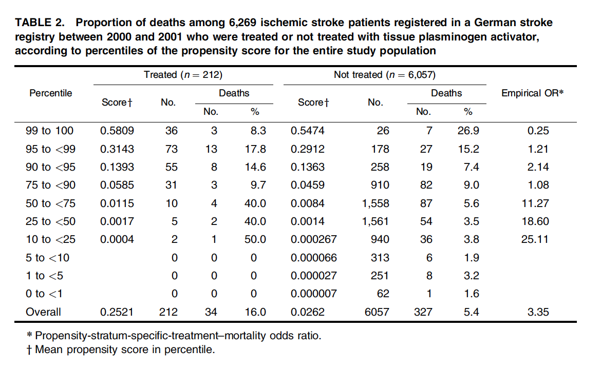

[Kurth T, Walker AM, Glynn RJ, et al. Results of multivariable logistic regression, propensity matching, propensity adjustment, and propensity-based weighting under conditions of nonuniform effect. Am J Epidemiol 2006;163(3):262--70.](https://academic.oup.com/aje/article/163/3/262/59818?login=false)

This paper was recommended reading by Steve Cole to investigate results of different confounding control in a non-uniform (heterogeneous) population. The goal was to estimate the effect of plasminogen activator (t-PA) on death among 6,000 ischemic stroke patients in a German stroke registry.

The authors investigating the results of using 5 different confounding control methods. Of particular interest were the different propensity score methods. The paper addressed the results from using (1) propensity score matching, (2) propensity score weighting with standardized-mortality-ratio (SMR) weights, and (3) propensity score weighting with inverse-probability-of-treatment (IPT) weights. My understanding is that 4 of the 5 methods found similar weighted odds ratio close to 1, whereas the IPTW odds ratio was nearly 11.

Quick propensity score definition: the probability an individual would have been treated based on that individual's pre-treatment values. Adjustments balance the observed covariates used to construct score. IPT weights are constructed as 1/p, where p is the predicted probability of treatment given a set of observed voariates, and SMR weights are calculated as 1 for the treated and p/(1-p) for the untreated.

This study fit a logistic regression model to estimate the propensity scores with the following pre-treatment variables: age, gender, Rankin scale, time from event to hospital admission, paresis, state of consciousness, type of admitting ward, transportation to hospital, aphasia, hypertension, and a bunch of other things. The associations of age, time from symptoms to admission, and Rankin scale changed the last 3 6-month periods, so a time-covariate interaction was included into the model for those three covariates. I did not see time period as a covariate in the model at all, which might also be interesting in how they treat patients probably changes over time.

The study included 6,269 ischemic stroke patients registered in a stroke registry between 2000 and 2001. 212 patients received treatment and 6,057 did not.

The gradient of the outcome (death) across levels of the propensity score for the treated and untreated groups were very different. No treated individuals were below the 10th percentile of propensity scores. Interestingly, among those not treated, mortality increased with increased propensity score, but among those treated, mortality decreased with increased propensity score. This indicates nonuniform effect.

203 patients were able to be matched with controls with a precision of 0.05 around the propensity score. This estimates the average treatment effect on the treated (ATT), because the population is being restricted to the characteristics of the treated group.This yielded an odds ratio of 1.17 (95% CI: 0.68, 2) from the 406 patient sample size. SMR weights similarly estimated the ATT, since the untreated patients are weighted to resemble the patients in the treated population. The SMR yields an odds ratio of 1.11 (95% CI: 0.67, 1.84). Honestly, I find it interesting that the confidence interval is not more precise by a bigger scale than it is, since the sample size is so much larger.

To attempt to put in terms for my brain, we are looking at treatment effect for the patients with characteristics that match those who were treated.

Conversely, the IPT weighted odds ratio was 10.77 (95% CI: 2.47, 47.04). This estimates the average treatment effect (ATE) -- the treatment effect had the entire population been treated. This estimate takes into account those patients with super small propensity scores who did not have counterparts in the treated group.

Anyways, there are no patients with propensity scores lower than the 10th percentile in the treated group. I am a newbie at this, but am thinking this violates the positivity identification condition. Positivity asserts that people at every level of covariates L has the chance to be in each treatment group. In this case, it is clear that when trying to estimate the ATE that condition is not met.

However, the ATT only is estimating treatment effect in the population that was treated. So we need the population to look like the treated population. In that case, we will be postulating that we can relax the positivity condition to allow for some type of partial positivity. That is, the positivity need only exist for the patients in the treated population.

I will come back to sharpen this later. There is more reading to do!
