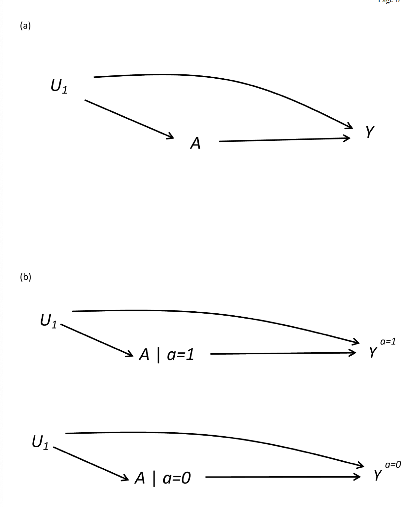
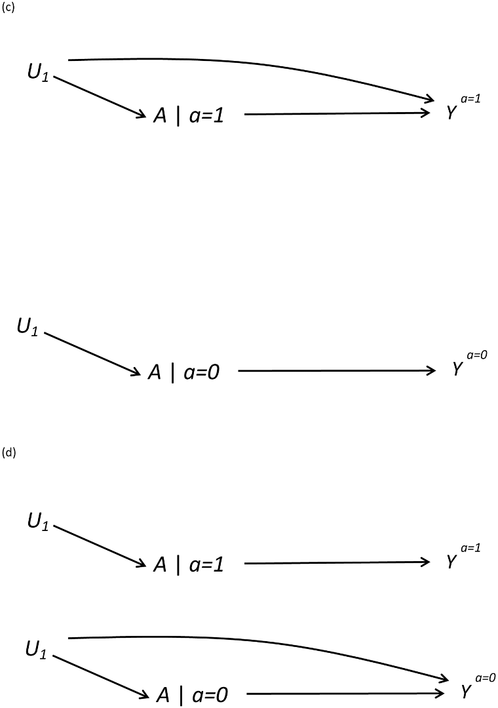

[Sarvet AL, Wanis KN, Stensrud MJ, Hernán MA. A Graphical Description of Partial Exchangeability. Epidemiology 2020;31(3):365–8.](https://journals.lww.com/epidem/Abstract/2020/05000/A_Graphical_Description_of_Partial_Exchangeability.9.aspx)

#### Partial exchangeability
Exchangebility is one of the three identification conditions for causal effects. It is achieved when the treated and untreated populations are _exchangeable_--that is, if the treated had been untreated, they would experience the same outcomes as the untreated, and vice versa. In observational studies, confounding is oft an issue which does not allow for exchangeability. This is where propensity score weighting or matching comes to create exchangeable populations. 

Savert identifies "partial exchangeability" to be a weaker condition to identify some causal effects. He identifies two types:

1. Partial exchangeability under treatment: identifies average treatment effect in the treated (weaker)
2. Partial exchangeability under no treatment: identifies average treatment effect in the untreated. 

The paper goes on to illustrate partial exchangeability using causal graphs. 

#### First, some notation.

\\( A \\) is a time-fixed binary treatment.

\\( Y^{a=1} \\) is an individual's potential outcome under treatment

\\( Y^{a=0} \\) is an individual's potential outcome under no treatment. 

Partial exchangeability under treatment holds if \\( Y^{a=1} \perp A \\)
Partial exchangeability under not treatment holds if \\( Y^{a=0} \perp A \\)

#### DAGS and SWIGS

* DAG: directed acyclic graph. Nodes demonstrate real world variables and edges demonstrate causal effects. 
* SWIG: single world intervention graph. SWIGS can "split" treatment nodes by replacing variables affected by treatment with counterfactual versions. Typically they show that the single world is invariant between treatment levels, but as illustrated by the later SWIG figures this does not need be the case. 

Complete exchangeability is equivalent to the absence of any backdoor paths between treatment and outcome on a causal DAG (without selection or measurement bias). However, the authors claim there is no equivalence for partial exchangeability on a DAG. 

The following figure demonstrates the same relationship using a DAG (a) and a SWIG (b). The DAG can only represent complete exchangeability because there is no way to separate the unmeasured confounder by treatment group. The SWIG presents a causal diagram for both potential outcomes, and the role of \\( U_1 \\) as a confounder. In (b), it is a confounder both for the treated and untreated groups. The DAG and SWIGS in this case show that exchangeability is not met due to the backdoor path of \\( U_1 \\). 

Figures (c) and (d) show the SWIGS when partial exchangeability holds. Figure (c) demonstrates when the unmeasured confounder is not on the backdoor path between \\(A|a=0\\) and \\(Y^{a=0}\\); i.e., exchangeability holds for the untreated group but does not for the treated. Figure (d) shows the opposite. 

#### Example

The authors consider a hypothetical RCT where adults are randomized to either appendectomy or antibiotics. 

\\( A \\) treatment received

\\( Y \\) presence of complication at 30 days

\\( Y^{a=0} \\) complications had all patients received antibiotics

\\( Y^{a=1} \\) complications had all patients received surgery

 \\(U_1 \\) unmeasured indicator for individuals predisposed to complications from anesthesia. 

Due to potential surgical apprehension for patients with anesthesia issues, these patients could possibly switch from surgery to antibiotics. Thus, \\(U_1\\) has a direct effect on treatment received and on surgical outcome and complete exchangeability cannot exist. However, this confounding does not have an effect on the outcome under antibiotics, so partial exchangebility holds in the antibiotic group. The SWIGs in Figure C represent this situation where \\( Y^{a=0} \perp A \\) holds. 

#### Doomed and immuned

Using a set of sufficient causes, the authors define patients as "doomed" (get outcome no matter what), immune (do not get outcome not matter what), "causative" (get outcome under treatment), and "preventive" (get outcome under no treatment). 

Complete exchangeability holds when the proportions of "doomed" + "preventive" and "doomed" + "causative" are the same in treated and untreated groups. 

Partial exchanagebility only requires one of the two conditions. For example, if the proportion of "doomed" + "preventive" is the same in treated and untreated, then only the ATT can be computed. 

#### Example continued

Ok, this was hard for me to wrap my head around. 
In the prior example of surgery vs. antibiotics, people randomized to surgery could possibly switch to antibiotics because of a potential known complication for anesthesia. So we said that partial exchangeability held for the potential outcome had **all patients received antibiotics**.

Because of this potential switching of treatment received, patients who received antibiotics may actually be at higher risk of the outcome had their received surgery. We can use the outcomes of the group treated with antibiotics to learn what would've happened if the group treated with surgery had been treated with antibiotics. However, because the antibiotics group may have that higher risk in surgery, we cannot use the outcomes in the surgery group to estimate what the outcomes would've been if the antibiotics group had received that surgery. In conclusion, we CAN estimate the treatment effect of surgery vs. antibiotics _in the group that was treated with surgery_. We have to keep in mind that this group differs from the population, because they are likely not predisposed to the same anesthesia issue. 