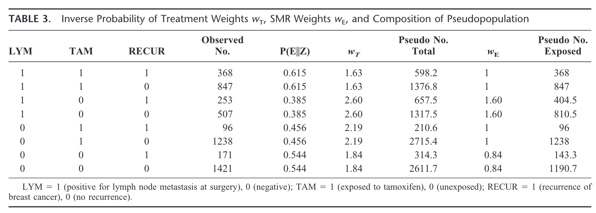

[Sato T, Matsuyama Y. Marginal structural models as a tool for standardization. Epidemiology 2003;14(6):680–6.](https://journals.lww.com/epidem/Fulltext/2003/11000/Marginal_Structural_Models_as_a_Tool_for.9.aspx)

This paper expands upon methods developed by Robins to estimate average treatment effect by weighting using marginal structural models. 

The authors begin by describing standardization in epidemiology, which are methods to control confounding by stratifying on confounding factors. 

In a simple stratified point exposure analysis, the IPTW estimator is identical to the estimator standardized to the total population. 

#### Methods of Standardization

The paper presents several ways of standardizing estimates, depending on the target population. 

The interpretations of the standardized estimators is valid even when stratum specific ratios are heterogeneous (effect measure modification)

**Notation:**

\\(x_k\\): number of outcome events in the exposed in the _k_ -th stratum. 

\\(n_k\\): number of exposed in the _k_ -th stratum.

\\(y_k\\): number of outcome events in the unexposed in the _k_ -th stratum.

\\(m_k\\): number of unexposed in the _k_ -th stratum.

##### Target population: Exposed group

The standardized mortality/morbidity ratio (SMR) estimates the overall effect of exposure in the ratio scale for the exposed group. 

$$ SMR = \frac{\sum_k{x_k}}{\sum_k{n_k\frac{y_k}{m_k}}} $$

Numerator is observed number of deaths (number of events in the exposed group when the exposed group was actually exposed), and denominator is the _expected_ number of deaths in the exposed group had they not been exposed (counterfactual number of deaths if the exposed had not been exposed). 

**In SMR**, exposed group is used as standard population. "Indirect standardization".

##### Target population: Unexposed group

The standardized risk ratio is given by:

$$ SRR_U = \frac{\sum_k{m_k\frac{x_k}{n_k}}} {\sum_k{y_k}}$$

\\( SRR_U \\) is interpreted as the proportionate change in risk that would have occurred in the unexposed group had they been exposed. This is _direct_ standardization. 

##### Target population: Total population

$$ SRR_T = \frac{\sum_k {N_k\frac{x_k}{n_k}}} {\sum_k {N_k\frac{y_k}{m_k}}}$$

\\(SRR_T\\) is the proportionate change in risk in the total group under complete exposure and complete nonexposure. 

### Marginal structural models

Robins et al. proposed to apply a weighted analysis procedure to the association model to give us unbiased causal estimates. 

Procedure:

1. Assume we have no unmeasured confounders given data on measured confounders **Z**

2. Assign a weight \\(w_{T_i}\\) to each subject \\(i\\) that is equal to the inverse of the conditional probability of receiving the subject's own exposure conditional on the subject's confounder information; i.e, \\(P(E|Z)\\)

3. Perform weighted analysis of the association model. 

    * Weights for exposed are \\(P(E=1|Z=z_i)^{-1}\\)
    * Weights for the unexposed are \\((1-P(E=1|Z=z_i))^{-1}\\)

Thus, we create the inverse probability of treatment weighted (IPTW) estimator. 

The standardized risk ratio with the total group as the standard (\\(SRR_T\\)) is identical to the IPTW estimator in the marginal structural model. 

#### Nice table summary 

Looking at the \\(LYM = 1\\) stratum, \\(P(TAM=1|LYM=1)=\frac{368+847}{368+847+253+507} = \frac{1215}{1975} = 0.615\\). Similarly, \\(P(TAM=1|LYM=0)= {1-0.615} = 0.385\\). 

Taking the inverse of the probability yields the weights \\(1.63\\) for the patients who received the exposure and \\(2.60\\) for the patients who did not. In this way we are "upweighting" the population that did not receive the exposure because, at least in this stratum, a lower proportion of patients did not receive the treatment. 

By multiplying the observed number by the calculated weights, we arrive at our pseudo total; e.g., \\(368*1.63=598.2\\). This is the number of women in the weighted pseudo-population for each combination of LYM, TAM, RECUR. 

#### Other targets

The IPTW estimator estimates population intervention effects. However, targeting other standard populations is also useful. Tying in the prior sections, we can use the \\(SMR\\) or \\(SRR_U\\) in the marginal structural models. 

The weights used in \\(SMR\\) are interpreted as the inverse of the conditional probability of receiving the subject's own exposure multipled by the conditional probability of receiving the exposure, regardless of the subject's exposure status. 

The SMR weight is given below:

`$$w_{Ei} = \frac{P(E=1|Z=z_i)}{P(E=e_i|Z=z_i)}$$`

The denominator controls confounding similar to IPTW; the numerator reweights to give distribution of covariates in the target population; in this case, the exposed group. 

It's clear that the exposed group the weight will always be 1 (the probabilities cancel) and the unexposed subjects it is the conditional exposure odds. Table 3 also shows this relationship. 

The weight construction for SMR can also be extended to the weights to target the unexposed group. 

### Example from paper

The authors present a study of 6148 women diagnosed with breast cancer and who received surgical treatment between 1982 and 1990 in Japan. The exposure of interest was tamoxifen and the outcome was recurrence of breast cancer. The crude rate ratio of 1.11 (95% CI: 0.97-1.27) found no protective effect of adjuvant tamoxifen on recurrence of breast cancer. 

They then used a weighted Poisson regression analysis with SMR weights. The propensity scores used to construct the SMR weights were estimated with a logistic model with age at surgery, stage of breast cancer, lymph node metastasis, and menopausal status chosen a confounding factors. The resulting rate ratio from the weighted Poisson regression (with the robust sandwich estimator) yielded a rate ratio of 0.89(95% CI: 0.78-1.02). This adjusted estimate is a large shift to show potential protective effect of tamoxifen use. 

### The end
Marginal structural models with IPTW give a nonparametric multivariate extension of the standardization method with the total group as the standard population. 

This paper shows that other choices of weights (all constructed with propensity scores) give the extension of the standardization method with other groups as the standard. 
