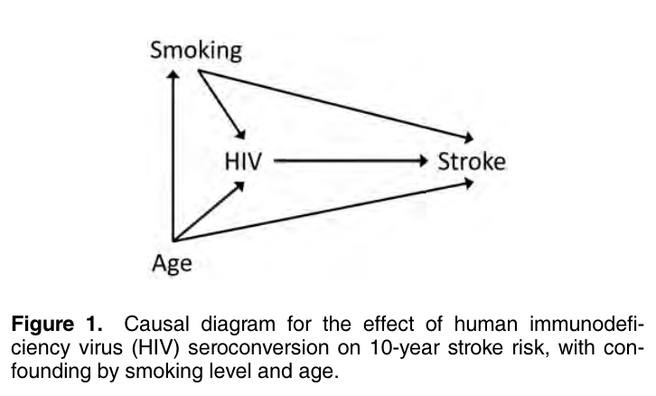
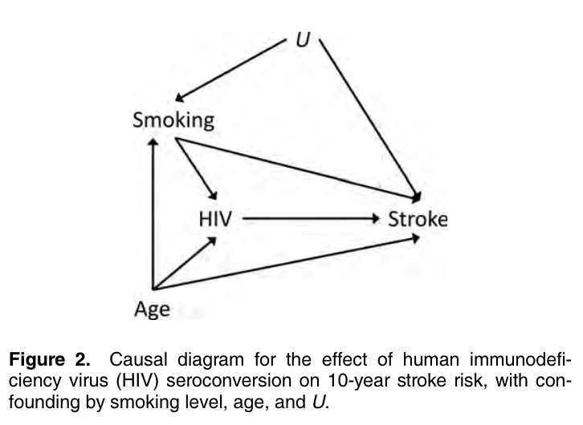

_Westreich D, Greenland S. The Table 2 Fallacy: Presenting and Interpreting Confounder and Modifier Coefficients. American Journal of Epidemiology 2013;177(4):292–8._

#### Motivation

Epidemiology uses the nomenclature "Table 1" to refer to the "first" table in a paper which describes the population under study. While Table 1 shows the descriptive statistics for important demographic and clinical characteristics, the aptly named "Table 2" often shows the statistical results for the primary, adjusted, outcome.

Westreich and Greenland go on about the Table 2 to mention that it often includes effect estimates for variables that did the adjusting. In their example, if we are interested in the effect of aspirin on some sort of outcome, adjusted for age and sex, the Table 2 the authors describe would have effect estimates for aspirin, age, and sex. 

The goal of this paper is to illuminate how this type of table is misleading and offer suggestions to improve the result presentation. 

#### Definitions

Primary effect: causal effect of an exposure of primary interest (e.g. aspirin from above example)

Secondary effect: causal effect of a covariate not of primary interest; confounders or effect measure modifiers (e.g. age and sex from earlier example)

Total effect: net of all associations of a variable through all causal pathways to the outcome

Direct effect: association after blocking or controlling some of those pathways. 

#### How can Table 2 be harmful?

Presenting adjusted estimates of secondary risk factors/covariates alongside the adjusted estimate of the primary exposure suggests that all of these estimates can be interpreted the same way. This should not be the case. 

#### Simple example
Figure 1 depicts a possible causal diagram for an observational study of the effect of HIV seroconversion on 10-year risk of stroke. Open pathways from HIV to stroke pass indicate confounding may be present by smoking and age. An explanation could be that risk of HIV increases with age and smoking. 

The following model could be used to adjust for these potential confounders:

$$ logit(Stroke|HIV, Smoking, Age) = \beta_0 + \beta_1\times HIV + \beta_2\times Smoking + \beta_3\times Age$$

All three estimates for HIV, smoking, and age could be reported in a Table 2. Readers may then assume all three estimates could be interpreted the same way, and causally since they are mutually adjusted. 

This would be wrong given the given causal diagram. Based on the model, \\(\beta_1\\) can be thought of as the total effect of HIV infection on the log odds of stroke given smoking and age. However, \\(\beta_2\\) cannot be interpreted the same way -- it is, instead, the direct effect of smoking on the log odds of stroke that is not mediated through HIV. This is because HIV is presented as a mediator of smoking and stroke in the causal diagram. A similar interpretation applies to \\(\beta_3\\), because both smoking and HIV are mediators of the relationship between age and stroke.

Many readers would interpret all three estimates as causal effects; however it is clear from the diagram that only \\(\beta_1\\) is a total effect, while the others are direct effects. 

#### Example with unmeasured confounding.

Figure 2 adds an unmeasured confounder U. Since this confounder only affects smoking and stroke, after adjustment for smoking the interpretation of \\(\beta_1\\) from the original model stays the same. 

However, \\(\beta_2\\) can no longer be interpreted as a direct effect of smoking on stroke because of the confounding from U. 

Less obviously, \\(\beta_3\\) _also_ can no longer be be interpreted as a direct effect of age on stroke. Smoking is a collider on the indirect path of age -> smoking <- U -> stroke. Adjustment for smoking in this context would open up a relationship between age and U, and thus would bias the effect estimate of age on stroke. 

In order to estimate unbiased direct effects of smoking and age in this scenario, our model would need an additional term that would be \\(\beta_4\times U\\). Assuming low risk of the outcome/collapsibility that the \\(\beta_1s\\) from each model would be about equal. However, \\(\beta_2\\) and \\(\beta_3\\) may differ substantially from each other in the two models due to the U adjustment. 

#### Heterogeneity of effect measures

Variation/heterogeneity of effect measures across covariate levels can complicate separating direct and indirect effects. The authors distinguish between two sources of "effect-measure variation". 

##### Source 1

I think in this scenario we are viewing the covariate as a secondary intervention variable. 

Variation in the effect measure attributable in a precise causal sense to effects of a modeled covariate. 

Huh?

In other words we are looking at a causal interaction here. In the absence of uncontrolled confounding, observed associations of the outcome with exposure and modeled covariate are due to the joint effects of the exposure and the covariate. 

##### Source 2

So I think now we are looking at the covariate as a "passive stratification factor". 

Variation in the effect measure attributable to the effects of uncontrolled covariates.

May not be confounders of the exposure effect but may still be confounders of the measured covariate effects. 

Authors draw parallel to effect measure modification, but I don't fully follow. 

#### Interaction with Figure 1

Assume severe enough heterogeneity such that the risk of stroke from HIV varied considerable with age and smoking. Then we would need the model:

$$ logit(Stroke|HIV, Smoking, Age) = \beta_0 + \beta_1\times HIV + \beta_2\times Smoking + \beta_3\times Age + \beta_4\times HIV\times Smoking + \beta_5\times HIV \times Age + \beta_6\times Smoking\times Age $$

I wonder why we are not including the interaction of HIV X Smoking X Age? \\(\beta_6\\) seems to imply that we would expect that there is an interaction of smoking and age on the risk of stroke -- why wouldn't we also assume the three way interaction?

The paper asserts that when product terms are present, single variable exposure terms represent effects only when all the covariates that appear in product terms with exposure are zero. So we need to center continuous variables around 0. The authors centered age by subtracting 40 years, and assume that non-smokers (Smoking = 0) were present in the sample. They also assume age is measured in decades and smoking is in packs/day. 

Assuming the mdoel in this section (and Figure 1), the "smoking and age specific total effect of HIV on the log odds of stroke" is \\(\beta_1+\beta_4\times Smoking + \beta_5\times Age\\), which varies with smoking and age. 

\\(\beta_1\\) is implied by the model to be the log-odds ratio of HIV stroke vs non-HIV stroke when the covariates are 0 (i.e. age is 40 and non-smoker). The HIV-smoking and HIV-aging interactions are then the variation from additivity in the log-odds ratio when smoking and age vary. \\(\beta_2\\) and \\(\beta_3\\) are the direct effects of smoking a pack a day on the log odds among 40 year-olds with HIV = 0 and the direct effect of aging a decade on the log-odds for non-HIV & non-smokers, respectively. 

Onto the interactions -- \\(\beta_4\\) is the change in the HIV effect on the log-odds produced by smoking one additional pack a day. It also adds to the direct effect of smoking on stroke in HIV positive people. So it represents a modification both of the total effect of HIV and the direct effect of smoking.

In a similar manner, \\(\beta_5\\) represents the change in total effect of HIV on the log odds of stroke from aging an additional decade & the change in the log odds ratio for the direct effect of aging produced by HIV on the outcome of stroke. 

At the end of this section they touch on the three way interaction and say interpretation would vary depending on the targeted effect. But isn't the targeted effect HIV? 

#### Interpretating Figure 2 with interaction

Assume Figure 2 is the causal model (so there is uncontrolled confounding) and

$$ logit(Stroke|HIV, Smoking, Age) = \beta_0 + \beta_1\times HIV + \beta_2\times Smoking + \beta_3\times Age + \beta_4\times HIV\times Smoking + \beta_5\times HIV \times Age + \beta_6\times Smoking\times Age $$

is the correct regression model. 

Interpretation of effect-measure variation across modeled covariates changes if any of the covariates are confounded by uncontrolled covariates, even if the primary exposure itself is not confounded. 

In this case, some (or all) of the variation in the **exposure** effect measure could be due to the uncontrolled covariates. In an extreme case, HIV effect could be constant across age and smoking given U. This means that U is the only cause of variation in the HIV effect and altering smoking or aging would not alter HIV effect measure. If this is the scenario, the statistical interaction terms in the previous model would not be representative of any causal interaction. 

Even if less extreme versions, if U is not controlled, observed variation of the HIV effect measure across smoking and age would not equal the change in HIV odds ratio that would be produced by a change in smoking or age. In this scenario, U partially (but maybe not fully) confounds the modification of HIV by smoking/age. _Also note that the confounding by age through U is introduced by conditioning on smoking, which is a collider between U and age_. 

##### Interpretating Table 2 in this case?

Supposing Figure 2 is the correct causal model and the previous model with interactions is the correct regression model. 

The model terms for smoking and age suffice to control the HIV/stroke relationship because is blocks all the backdoor paths. 

However, the confounding of smoking by U will bias most interpretations about the effect of smoking or aging on stroke of the HIV effect measure on stroke. We cannot interpret \\(\beta_2\\) or \\(\beta_3\\) as direct effects. Additionally, \\(\beta_4\\), \\(\beta_5\\), and \\(\beta_6\\) are not longer the deviations from additivity of the joint causal effects on the log odds. 

In a more general way, U could confound the modification of the HIV effect measure by age and sex, but it does not confound the smoking and age specific total effects of HIV. 

#### Bonus reason to avoid presenting everything in Table 2

The authors make a note that the desire for presenting simple estimates in a Table 2 could discourage researchers from using more flexible (but less interpretable) variable specifications. 

But, the extra labor and commentary is sometimes a trade-off researchers don't want to make because of the inability to interpret them. 

#### Avoiding Table 2 fallacies

* Draw a causal diagram
* Limit Table 2 to estimates of the primary exposure effect measures under different models. 
    * Report secondary "adjustment" covariates in a footnote with how they were categorized or modeled. 
* If the secondary direct effects are of interest, include the estimates but clearly state in the text description they are direct effect. 
    * But then you should include confounders of the secondary covariates in the model. 

#### The End

Mostly, don't interpret all the estimated parameters from a model as causal effects. Specifically in this paper as "total effect estimate". As a final note -- think about the ethics behind thinking about holding covariate levels "constant" -- i.e., direct effect of age requires holding smoking and HIV levels constant, which is both unethical for smokers and infeasible for those HIV negative. 